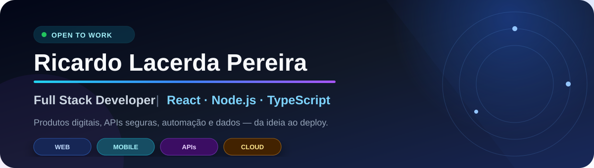
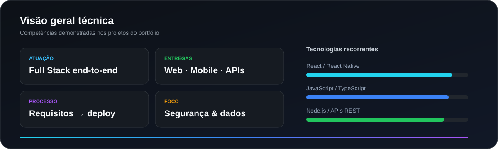
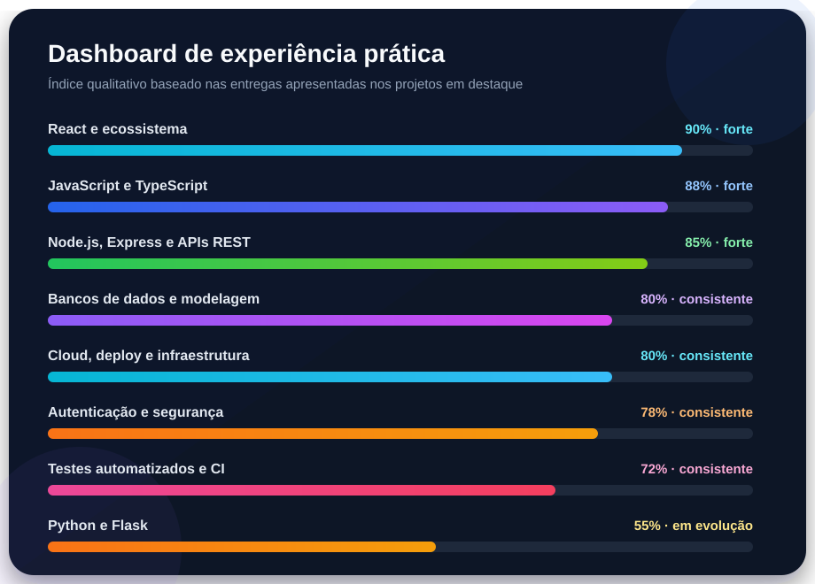
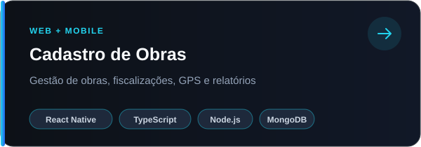
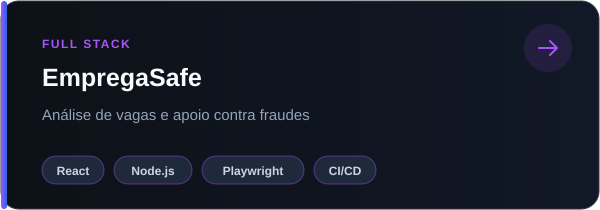
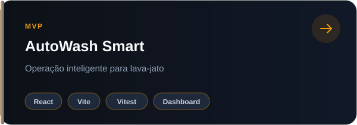
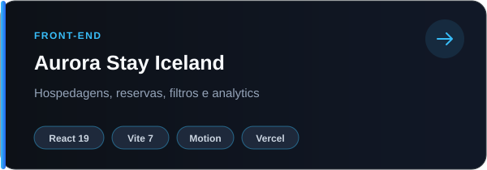

<div align="center">



<br />

[](https://portfolio-ricardo-lacerda.vercel.app/)
[](https://www.linkedin.com/in/ricardo-lacerda-pereira/)
[](mailto:ricardolacper@gmail.com)
[](https://github.com/Riclacper?tab=followers)

**Desenvolvedor Full Stack** focado em produtos digitais, sistemas de gestão, APIs seguras e automação de processos.

[Sobre](#-sobre-mim) • [Stack](#-stack-tecnológica) • [Dashboard](#-github-dashboard) • [Projetos](#-projetos-em-destaque) • [Contato](#-vamos-conversar)

</div>

---

## 👨‍💻 Sobre mim

```text
🎓  Formado em Análise e Desenvolvimento de Sistemas — Senac Recife
🏢  Empreendedor e gestor da iCanada Reparos
🧰  Criador do iCanada Gestão, produto Full Stack em homologação
🔐  Foco em segurança, qualidade de dados, testes e observabilidade
🚀  Atuação da descoberta do problema ao deploy e manutenção
💼  Aberto a oportunidades Full Stack, Front-end ou Back-end
```

Transformo necessidades reais de negócio em software. No **iCanada Gestão**, atuo no levantamento de requisitos, modelagem de processos, frontend, backend, migração de dados, segurança, testes e infraestrutura em nuvem.

---

## 🧩 Stack tecnológica

<div align="center">

#### Front-end & Mobile

[](https://skillicons.dev)
&nbsp;&nbsp;


#### Back-end & Dados

[](https://skillicons.dev)

#### Qualidade, Cloud & Ferramentas

[](https://skillicons.dev)


</div>

---

## 📊 GitHub dashboard

<div align="center">
  
</div>

<div align="center">
  
</div>

<div align="center">
  
</div>

<details>
<summary><strong>Ver dashboard de experiência por área</strong></summary>
<br />


> Os níveis representam a experiência demonstrada nos projetos do portfólio. São indicadores qualitativos de recorrência e profundidade, não certificações.
</details>

---

## 📌 Projetos em destaque

<div align="center">
  <a href="https://github.com/Riclacper/cadastro-obras-andamento">
    
  </a>
  <a href="https://github.com/Riclacper/emprega-safe-react-node">
    
  </a>
  <a href="https://github.com/Riclacper/AutoWashSmart">
    
  </a>
  <a href="https://github.com/Riclacper/aurora-stay-iceland">
    
  </a>
</div>

| Projeto | Solução e diferenciais | Demo |
| --- | --- | :---: |
| **Cadastro de Obras** | Web/mobile, perfis de acesso, GPS, fotos, dashboards, PDF e API | [Acessar](https://cadastro-obras-andamento.vercel.app/) |
| **EmpregaSafe** | Análise de vagas, autenticação, relatórios, internacionalização, testes e CI | [Acessar](https://empregasafe.netlify.app) |
| **AutoWash Smart** | MVP responsivo com fluxos operacionais, dashboard e testes | [Acessar](https://auto-wash-smart.vercel.app) |
| **Aurora Stay Iceland** | SPA de hospedagens com busca, filtros, reservas e analytics | [Acessar](https://aurora-stay-iceland.vercel.app/) |
| **iCanada Gestão** | Produto empresarial real, migração de dados, segurança e cloud | Privado |

<details>
<summary><strong>Conheça os detalhes técnicos dos projetos</strong></summary>

### 🏗️ Cadastro de Obras

Sistema web e mobile para acompanhamento de obras e fiscalizações. Utiliza **React Native, Expo, TypeScript, Node.js, Express, MongoDB, JWT, Resend, Render e Vercel**.

### 🛡️ EmpregaSafe

Sistema Full Stack para identificar sinais de fraude em vagas de emprego. Inclui autenticação, recuperação de senha, análise por regras e IA opcional, denúncias, PDF, **Vitest, Playwright e GitHub Actions**.

### 🚗 AutoWash Smart

MVP demonstrativo para operação de lava-jato, com clientes, veículos, lavagem, self-service, mini shop e dashboard. Construído com **React, Vite, Vitest, ESLint e GitHub Actions**.

### 🏔️ Aurora Stay Iceland

SPA responsiva de hospedagens com filtros, detalhes, cálculo de reservas e dashboard analítico, construída com **React 19, Vite 7, Framer Motion e Vercel**.

### 🧰 iCanada Gestão

Sistema empresarial próprio que centraliza clientes, estoque, ordens de serviço, vendas, orçamentos e relatórios. Usa **React, Node.js, Express MVC, Supabase PostgreSQL e Auth**, cookies HttpOnly, CSRF, rate limiting, Cloudflare, Render e Resend. Está em homologação e evolução contínua.

</details>

---

## 🎓 Formação & foco atual

- **Análise e Desenvolvimento de Sistemas — Senac Recife**, concluído em junho de 2026.
- Quatro períodos cursados em **Tecnologia em Redes de Computadores**, agregando fundamentos de infraestrutura e redes.
- Foco atual em **segurança de aplicações, arquitetura de APIs, qualidade de dados, testes, observabilidade e automação de processos**.

---

## 📫 Vamos conversar?

<div align="center">

Busco oportunidades para contribuir com produtos que resolvam problemas reais com **organização, segurança e propósito**.

[](https://portfolio-ricardo-lacerda.vercel.app/)
[](https://www.linkedin.com/in/ricardo-lacerda-pereira/)
[](mailto:ricardolacper@gmail.com)

<br />


</div>
